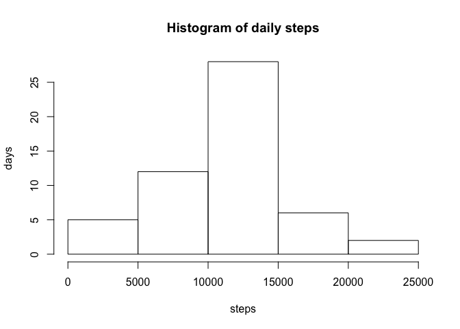
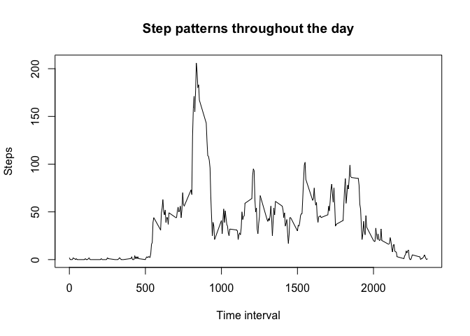
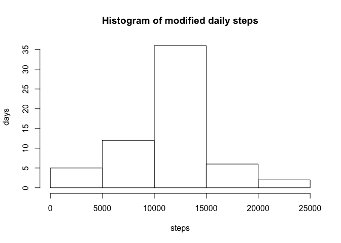
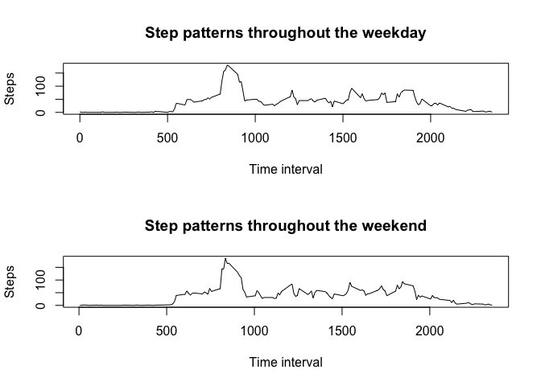

Preprocessing data
==================

This section shows the retrieval and processing of biodata from wearable
devices.

    #reading in the csv file with biodata from wearables
    zipfile<-tempfile()
    download.file('https://d396qusza40orc.cloudfront.net/repdata%2Fdata%2Factivity.zip',zipfile)
    biodata<-read.csv(unz(zipfile,"activity.csv"))
    #looking at the data
    str(biodata)

    ## 'data.frame':    17568 obs. of  3 variables:
    ##  $ steps   : int  NA NA NA NA NA NA NA NA NA NA ...
    ##  $ date    : Factor w/ 61 levels "2012-10-01","2012-10-02",..: 1 1 1 1 1 1 1 1 1 1 ...
    ##  $ interval: int  0 5 10 15 20 25 30 35 40 45 ...

    #using unique to see all the date range we'll find
    unique(biodata$date)

    ##  [1] 2012-10-01 2012-10-02 2012-10-03 2012-10-04 2012-10-05 2012-10-06
    ##  [7] 2012-10-07 2012-10-08 2012-10-09 2012-10-10 2012-10-11 2012-10-12
    ## [13] 2012-10-13 2012-10-14 2012-10-15 2012-10-16 2012-10-17 2012-10-18
    ## [19] 2012-10-19 2012-10-20 2012-10-21 2012-10-22 2012-10-23 2012-10-24
    ## [25] 2012-10-25 2012-10-26 2012-10-27 2012-10-28 2012-10-29 2012-10-30
    ## [31] 2012-10-31 2012-11-01 2012-11-02 2012-11-03 2012-11-04 2012-11-05
    ## [37] 2012-11-06 2012-11-07 2012-11-08 2012-11-09 2012-11-10 2012-11-11
    ## [43] 2012-11-12 2012-11-13 2012-11-14 2012-11-15 2012-11-16 2012-11-17
    ## [49] 2012-11-18 2012-11-19 2012-11-20 2012-11-21 2012-11-22 2012-11-23
    ## [55] 2012-11-24 2012-11-25 2012-11-26 2012-11-27 2012-11-28 2012-11-29
    ## [61] 2012-11-30
    ## 61 Levels: 2012-10-01 2012-10-02 2012-10-03 2012-10-04 ... 2012-11-30

    #using unique to see all the interval values we'll find
    unique(biodata$interval)

    ##   [1]    0    5   10   15   20   25   30   35   40   45   50   55  100  105
    ##  [15]  110  115  120  125  130  135  140  145  150  155  200  205  210  215
    ##  [29]  220  225  230  235  240  245  250  255  300  305  310  315  320  325
    ##  [43]  330  335  340  345  350  355  400  405  410  415  420  425  430  435
    ##  [57]  440  445  450  455  500  505  510  515  520  525  530  535  540  545
    ##  [71]  550  555  600  605  610  615  620  625  630  635  640  645  650  655
    ##  [85]  700  705  710  715  720  725  730  735  740  745  750  755  800  805
    ##  [99]  810  815  820  825  830  835  840  845  850  855  900  905  910  915
    ## [113]  920  925  930  935  940  945  950  955 1000 1005 1010 1015 1020 1025
    ## [127] 1030 1035 1040 1045 1050 1055 1100 1105 1110 1115 1120 1125 1130 1135
    ## [141] 1140 1145 1150 1155 1200 1205 1210 1215 1220 1225 1230 1235 1240 1245
    ## [155] 1250 1255 1300 1305 1310 1315 1320 1325 1330 1335 1340 1345 1350 1355
    ## [169] 1400 1405 1410 1415 1420 1425 1430 1435 1440 1445 1450 1455 1500 1505
    ## [183] 1510 1515 1520 1525 1530 1535 1540 1545 1550 1555 1600 1605 1610 1615
    ## [197] 1620 1625 1630 1635 1640 1645 1650 1655 1700 1705 1710 1715 1720 1725
    ## [211] 1730 1735 1740 1745 1750 1755 1800 1805 1810 1815 1820 1825 1830 1835
    ## [225] 1840 1845 1850 1855 1900 1905 1910 1915 1920 1925 1930 1935 1940 1945
    ## [239] 1950 1955 2000 2005 2010 2015 2020 2025 2030 2035 2040 2045 2050 2055
    ## [253] 2100 2105 2110 2115 2120 2125 2130 2135 2140 2145 2150 2155 2200 2205
    ## [267] 2210 2215 2220 2225 2230 2235 2240 2245 2250 2255 2300 2305 2310 2315
    ## [281] 2320 2325 2330 2335 2340 2345 2350 2355

    #convert date to POSIX
    biodata$date<-as.POSIXct(biodata$date)

What is the mean total number of steps taken per day?
=====================================================

This shows a histogram, mean and median of steps each day.

    #calculating daily steps
    daily.steps<-tapply(biodata$steps,biodata$date,sum)
    #making a histogram of daily steps
    hist(daily.steps,xlab='steps',ylab='days',main='Histogram of daily steps')

    #mean of daily steps (to nearest step)
    paste('The mean of daily steps is',round(mean(daily.steps,na.rm=TRUE)))

    ## [1] "The mean of daily steps is 10766"

    #median of daily steps
    paste('The median of daily steps is',median(daily.steps,na.rm = TRUE))

    ## [1] "The median of daily steps is 10765"

What is the average daily activity pattern?
===========================================

    #averaging steps at specific intervals of the day, to the whole step
    avg.by.interval<-round(tapply(biodata$steps,biodata$interval,mean,na.rm=TRUE))
    #creating a time interval
    plot(y=avg.by.interval,x=(names(avg.by.interval)),xlab="Time interval",ylab="Steps",type='l',main='Step patterns throughout the day') 

    #takes maximum of interval averages, retrieves the interval number, puts it in a sentence
    paste('The maximum steps at a specific interval (averaged across all days) is',max(avg.by.interval),'at interval',names(avg.by.interval[avg.by.interval==max(avg.by.interval)]))

    ## [1] "The maximum steps at a specific interval (averaged across all days) is 206 at interval 835"

Inputing missing values
=======================

    #prints out the number of NAs
    paste('The number of NA values in our data is',sum(is.na(biodata)))

    ## [1] "The number of NA values in our data is 2304"

    #making a copy of data to preserve original
    biodata.fill<-biodata
    #extracting a list of the time intervals of the NA values and putting in a vector
    na.ints<-biodata[is.na(biodata),]$interval
    #preparing another vector of indices
    avg.ind<-(na.ints-c(rep(0,12),rep(45,12),rep(90,12),rep(135,12),rep(180,12),rep(225,12),rep(270,12),rep(315,12),rep(360,12),rep(405,12),rep(450,12),rep(495,12),rep(540,12),rep(585,12),rep(630,12),rep(675,12),rep(720,12),rep(765,12),rep(810,12),rep(855,12),rep(900,12),rep(945,12),rep(990,12),rep(1035,12)))/5+1
    #prepares vectors of average by intervals without names
    avs.ints.uname<-unname(unlist(avg.by.interval))
    #making a list of missing values based on averages at the time interval /5+1 is to get index
    missing.vals<-avs.ints.uname[avg.ind]
    #putting the missing values in the NA slots
    biodata.fill$steps[is.na(biodata.fill$steps)]<-missing.vals
    #calculating daily steps
    daily.steps2<-round(tapply(biodata.fill$steps,biodata.fill$date,sum))
    #making a histogram of modified daily steps
    hist(daily.steps2,xlab='steps',ylab='days',main='Histogram of modified daily steps')

    #mean of modified daily steps
    paste('The mean of daily steps is',round(mean(daily.steps2)))

    ## [1] "The mean of daily steps is 10878"

    #median of modified daily steps
    paste('The median of daily steps is',median(daily.steps2))

    ## [1] "The median of daily steps is 11458"

    paste('Notice the differences between the first and second means; 1st:',round(mean(daily.steps,na.rm = TRUE)),'2nd:',round(mean(daily.steps2)))

    ## [1] "Notice the differences between the first and second means; 1st: 10766 2nd: 10878"

    paste('And the medians; 1st:',median(daily.steps,na.rm = TRUE),'2nd:',median(daily.steps2))

    ## [1] "And the medians; 1st: 10765 2nd: 11458"

Are there differences in activity patterns between weekdays and weekends?
=========================================================================

    # Calculating the days of the week and placing in vector
    Day<-(weekdays(biodata.fill$date))
    # adding a column to a copy of the data frame
    full.days<-cbind(biodata.fill,Day)
    #reducing factors into weekend and weekday
    levels(full.days$Day)<-c("Weekday","Weekday","Weekend","Weekend","Weekday","Weekday","Weekday")
    #creating averages for just the weekdays
    avg.by.interval.weekday<-round(tapply(full.days$steps[levels(full.days$Day)=='Weekday'],full.days$interval[levels(full.days$Day)=='Weekday'],mean))
    #creating averages for just the weekends
    avg.by.interval.weekend<-round(tapply(full.days$steps[levels(full.days$Day)=='Weekend'],full.days$interval[levels(full.days$Day)=='Weekend'],mean))
    #creating a panel plot
    par(mfrow=c(2,1))
    plot(avg.by.interval.weekday,x=(names(avg.by.interval.weekday)),xlab="Time interval",ylab="Steps",type='l',main='Step patterns throughout the weekday')
    plot(avg.by.interval.weekend,x=(names(avg.by.interval.weekend)),xlab="Time interval",ylab="Steps",type='l',main='Step patterns throughout the weekend')

    paste('The difference between weekday and weekend is minimal, with the absolute largest difference on any one interval being',max(abs(avg.by.interval.weekend-avg.by.interval.weekday)),'steps and the total absolute difference being',sum(abs(avg.by.interval.weekend-avg.by.interval.weekday)))

    ## [1] "The difference between weekday and weekend is minimal, with the absolute largest difference on any one interval being 24 steps and the total absolute difference being 788"
